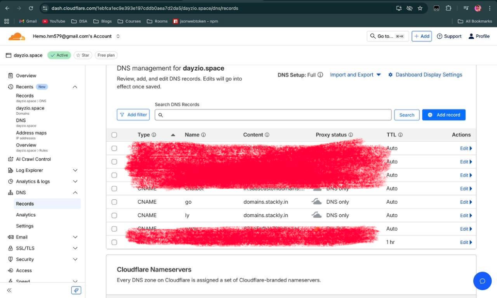

# Branded Domain Setup

Custom branded domains allow you to use your own domain name (e.g., `link.yourbrand.com`) for your shortened links instead of the default `stackly.in`. This builds trust, increases click-through rates, and reinforces your brand identity.

## Prerequisites

- A Stackly account with a Premium plan.
- Access to your domain's DNS settings (usually found in your domain registrar's dashboard like GoDaddy, Namecheap, Cloudflare, etc.).

## Step-by-Step Setup Guide

### 1. Add Your Domain in Stackly

1. Log in to your **Stackly Dashboard**.
2. Navigate to **Settings** > **Branded Domains**.
3. Click on **Add New Domain**.
4. Enter your desired domain or subdomain (e.g., `link.yourcompany.com` or `yourcompany.link`).
5. Click **Add Domain**.

### 2. Configure DNS Records

You need to point your domain to Stackly's servers so that links work correctly.

#### For Subdomains (Recommended)
If you are using a subdomain like `link.yourbrand.com`:

1. Log in to your domain registrar's DNS management page.
2. Add a new **CNAME Record**.
3. **Host/Name**: `link` (or whatever subdomain you chose).
4. **Value/Target**: `cname.stackly.in`
5. **TTL**: Automatic or 3600 seconds.

#### For Root Domains
If you are using a root domain like `yourbrand.link`:

1. Log in to your domain registrar's DNS management page.
2. Add a new **A Record**.
3. **Host/Name**: `@`
4. **Value/Target**: `76.76.21.21` (Stackly IP)
5. **TTL**: Automatic or 3600 seconds.

### 3. Verify Domain

1. Go back to the **Stackly Dashboard** > **Branded Domains**.
2. Find your domain in the list.
3. Click the **Verify** button.
4. Stackly will check your DNS records. This may take up to 24 hours depending on DNS propagation, but usually happens within minutes.
5. Once verified, the status will change to **Active**.

## Using Your Branded Domain

Once active, you can select your branded domain when creating new short links.

1. Go to **Create Short URL**.
2. In the **Domain** dropdown, select your custom domain.
3. Enter your custom slug (e.g., `summer-sale`).
4. Your final link will be `link.yourbrand.com/summer-sale`.

## Troubleshooting

- **"Domain not verified"**: DNS changes can take time. Wait a few minutes and try again. Ensure there are no conflicting records (like other A or CNAME records for the same host).
- **SSL/HTTPS Issues**: Stackly automatically provisions SSL certificates for your branded domains. This process can take up to 1 hour after verification.

## Need Help?

If you're stuck, please contact our support team at [support@stackly.in](mailto:support@stackly.in).
